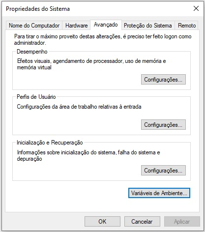

# Apache Ant

A ferramenta Ant tem a capacidade de automatizar diversas tarefas que fazem parte do ciclo de vida de desenvolvimento de software.

## Realizando o download e descompactando

A instalação e configuração do Apache Ant resume-se no download, descompactação dos arquivos e nas configurações das variáveis de ambiente.

1. Acesse o site do [Apache Ant™](https://ant.apache.org/bindownload.cgi) e escolha o arquivo ZIP para fazer o download;

2. Após o download, descompacte o conteúdo do arquivo ZIP no diretório desejado, recomenda-se na raiz do disco local.

## Criando e configurando as variáveis de ambiente

Para que o Apache Ant funcione corretamente, é necessário criar uma variável de ambiente chamada **ANT_HOME** e adicionar a variável no Path. 

1. Abra o menu de contexto (popup) sobre o ***Computador*** e selecione ***Propriedades***:

2. Será exibida a janela Propriedades do Sistema, selecione a guia ***Avançado*** e clique em ***Variáveis de ambiente***;

    

3. Na janela Variáveis de Ambiente, no quadro ***Variáveis do sistema*** clique em Novo e Informe os dados solicitados:

    Dado              | Valor
    -----             | -----
    Nome da Variável  | ANT_HOME
    Valor da Variável | Diretório onde o Apache Ant foi instalado (descompactado)

4. Ainda nas Variáveis do sistema, localize a variável de ambiente chamada ***Path***, selecione-a e clique em Editar para adicionar os seguintes dados ao valor deste campo:

    Dado              | Valor
    -----             | -----
    Valor da Variável | %ANT_HOME%\bin;

    Obs.: Não remova o restante do conteúdo.

## Validando os procedimentos realizados

Após finalizar a instalação e configuração, você pode verificar se os procedimentos realizados foram efetivos executando o seguinte comando:

```bash
ant -version
```

Se a instalação e as configurações estiverem corretas, será exibida uma mensagem informando a versão do Apache Ant.

# Conceito do arquivo buildfile

No Ant, usamos um arquivo em formato XML que age como um script de tarefas a serem executadas. Nesse arquivo, é necessário termos elementos que vão definir um conjunto de tarefas a serem executadas.

Veja o [PDF](./docs/apache_ant.pdf) para obter mais informações.

# Java Archive

Um aquivo .jar (Java Archive) é um formato de arquivo compactado que geralmente é utilizado para agrupar arquivos de classes Java e recursos associados (imagens, bibliotecas, etc.). Caso uma das classes agrupadas neste arquivo definir um método main, ele funcionará quase como um executável.

## Como criar um arquivo jar usando ant

Entre na pasta contendo o build.xml e execute o comando:

```bash
ant
```

Quando executamos o Ant, ele lê o arquivo build.xml, e procura no elemento do projeto o target padrão, em seguida, o ant procura os targets dos quais o target padrão depende. Primeiro é executado os targets de dependencia em seguida o target padrão, gerando por fim o arquivo .jar correspondente.
